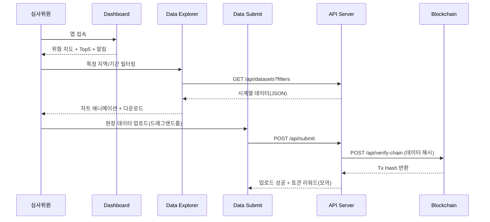

# gcrc-interactive-dashboard
2025 HUSS Agora Hackathon

# 🌍 GCRC: Global Climate Risk Center Web Platform

**완전한 멀티페이지 실시간 웹 애플리케이션**  
GCRC(Global Climate Risk Center)는 글로벌 기후 위험 데이터를 실시간 수집·시각화하고, 시민과 기관이 함께 기여할 수 있는 오픈 플랫폼입니다.

> ⚡ 목적: **데이터 표준화 + 실시간 분석 + 협력 워크플로우**를 한 화면에서

---

## 🚀 구현 기능(멀티페이지)

1. **🏠 실시간 대시보드**

   * 글로벌 기후 위험 지도(Leaflet)
   * Top 5 위험 지역 실시간 순위
   * 실시간 경보 피드(20초 폴링)
   * 핵심 통계/기술 스택 카드

2. **📊 데이터 탐색**

   * 고급 필터(국가/기간/변수)
   * 인터랙티브 차트(온도·강수량)
   * 다운로드 테이블(CSV/JSON)
   * 실시간 데이터셋 상태 표시

3. **📤 데이터 제공**

   * 시민 과학자 업로드 폼
   * 드래그 앤 드롭 파일 업로드
   * 측정값 입력(위치/시간/값)
   * **GCRC 토큰 리워드** 모의 로직

4. **🔗 API 문서**

   * 실제처럼 보이는 엔드포인트 예시
   * `curl` 샘플 & JSON 응답 예시
   * API 키 발급 가이드(모의)
   * 블록체인 검증 API 더미

5. **🤝 파트너십**

   * 국제기구/기업 파트너 현황
   * 실시간 협력 상태(활성/협상중/테스트)
   * 파트너십 신청(폼 제출)

---

## ✨ 인터랙티브 UX

* **fadeIn** 페이지 전환
* **20초 간격** 실시간 알림 업데이트
* 데이터 탐색 진입 시 **차트 로딩 애니메이션**
* **Drag\&Drop** 파일 업로드
* 파트너십 **상태 배지** 실시간 표시

---

## 🧭 아키텍처 개요(Flow)

```mermaid
flowchart LR
  subgraph Client[Browser App]
    A[Dashboard] --> B[Data Explorer]
    A --> C[Alerts Feed]
    B --> D[Download/Export]
    A --> E[Partner Status]
    F[Data Submit] --> A
  end

  subgraph API[Mock API (Node.js/FastAPI)]
    G[/GET /api/risk-map/]
    H[/GET /api/alerts/]
    I[/GET /api/datasets?filters/]
    J[/POST /api/submit/]
    K[/GET /api/partners/]
    L[/POST /api/verify-chain/]
  end

  subgraph Chain[Blockchain Testnet]
    M[(Tx: data hash)]
  end

  Client <---> API
  J --> L --> M
```

---

## 👤 유저 플로우(시연용)



---

## 🛠 기술 스택

* **Frontend**: HTML, CSS, JavaScript (Vanilla or React)
* **Charts/Map**: Chart.js, Leaflet.js
* **Backend**: Node.js (Express) *또는* FastAPI (시뮬레이션용)
* **DB**: MongoDB (모의 데이터)
* **Blockchain**: Ethereum Testnet (데이터 해시 검증 more-like)
* **Deploy**: GitHub Pages(프론트), Vercel/Render(API)

---

## 📦 설치 & 실행

```bash
# 레포 클론
git clone https://github.com/<username>/<repo-name>.git
cd <repo-name>

# 프론트 의존성 (React 사용 시)
npm install
npm run dev   # or npm run start

# 백엔드(예: Node.js) 폴더로 이동
cd server
npm install
npm run dev   # .env 필요
```

---

## 🗂️ 폴더 구조(예시)

```
<repo-name>/
├─ public/              # 정적 리소스
├─ src/
│  ├─ pages/            # dashboard, explorer, submit, api-docs, partners
│  ├─ components/       # charts, maps, tables, cards, upload
│  ├─ utils/            # fetcher, formatters, constants
│  ├─ styles/           # css
│  └─ main.(js|tsx)
├─ server/
│  ├─ index.js          # Express 서버 엔트리
│  ├─ routes/
│  │  ├─ alerts.js
│  │  ├─ datasets.js
│  │  ├─ submit.js
│  │  └─ partners.js
│  ├─ services/
│  │  ├─ chain.js       # 해시 검증 모의
│  │  └─ db.js
│  └─ models/           # (옵션) mongoose schemas
├─ mock/
│  ├─ datasets.json
│  ├─ alerts.json
│  └─ partners.json
└─ README.md
```


필요하면 \*\*배지(빌드/라이선스/PRs Welcome)\*\*나 **한영 병기**도 추가해줄 수 있어.
레포 이름은 개인적으로 `gcrc-live-platform` 추천!
