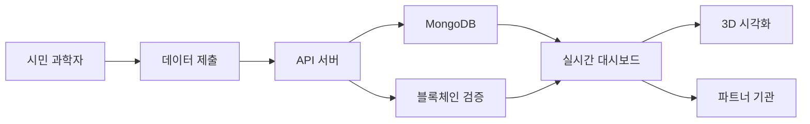

# 🌍 GCRC: Global Climate Risk Center

**2025 HUSS Agora Hackathon** - 완전한 멀티페이지 실시간 웹 애플리케이션

GCRC(Global Climate Risk Center)는 글로벌 기후 위험 데이터를 실시간 수집·시각화하고, 시민과 기관이 함께 기여할 수 있는 오픈 플랫폼입니다.

## 🎯 프로젝트 목적

**데이터 표준화 + 실시간 분석 + 협력 워크플로우**를 한 화면에서 구현하여 기후 변화 대응을 위한 통합 플랫폼을 제공합니다.

## ✨ 주요 기능

### 🏠 실시간 대시보드
- 글로벌 기후 위험 지도 (Leaflet.js)
- Top 5 위험 지역 실시간 순위
- 실시간 경보 피드 (20초 폴링)
- 핵심 통계 및 기술 스택 카드

### 📊 데이터 탐색
- 고급 필터 (국가/기간/변수)
- 인터랙티브 차트 (온도·강수량)
- 다운로드 테이블 (CSV/JSON)
- 실시간 데이터셋 상태 표시

### 📤 데이터 제출
- 시민 과학자 업로드 폼
- 드래그 앤 드롭 파일 업로드
- 측정값 입력 (위치/시간/값)
- GCRC 토큰 리워드 모의 로직

### 🔗 API 문서
- 실제처럼 보이는 엔드포인트 예시
- `curl` 샘플 & JSON 응답 예시
- API 키 발급 가이드 (모의)
- 블록체인 검증 API 더미

### 🤝 파트너십
- 국제기구/기업 파트너 현황
- 실시간 협력 상태 (활성/협상중/테스트)
- 파트너십 신청 폼

### 🎨 3D 시각화
- Blender 통합 기후 위험 3D 렌더링
- 지역별 위험도 높이 애니메이션
- 실시간 데이터 기반 시각화

## 🛠 기술 스택

### Frontend
- **HTML5, CSS3, JavaScript (Vanilla)**
- **Chart.js** - 데이터 시각화
- **Leaflet.js** - 인터랙티브 지도
- **Vite** - 개발 서버 및 빌드 도구

### Backend
- **Node.js + Express.js** - API 서버
- **MongoDB** - 데이터베이스 (모의)
- **CORS, Helmet, Morgan** - 보안 및 로깅

### Blockchain
- **Ethereum Testnet** - 데이터 해시 검증
- **Web3.js** - 블록체인 연동

### 3D Visualization
- **Blender + Python** - 3D 기후 시각화
- **자동 렌더링 파이프라인**

### Deployment
- **Frontend**: GitHub Pages, Vercel
- **Backend**: Render, Railway
- **Database**: MongoDB Atlas

## 📦 설치 및 실행

### 1. 프로젝트 클론

```bash
git clone https://github.com/your-username/gcrc-interactive-dashboard.git
cd gcrc-interactive-dashboard
```

### 2. 의존성 설치

```bash
# 루트에서 프론트엔드 및 백엔드 의존성 설치
npm install

# 서버 의존성 설치
cd server
npm install
cd ..
```

### 3. 환경변수 설정

```bash
# 환경변수 파일 복사
cp .env.example .env

# .env 파일을 편집하여 필요한 값 설정
# MongoDB URI, API 키 등 (선택사항 - Mock 모드 기본)
```

### 4. 개발 서버 실행

```bash
# 프론트엔드와 백엔드 동시 실행
npm run dev

# 또는 개별 실행
npm run client:dev  # 프론트엔드만
npm run server:dev  # 백엔드만
```

### 5. 접속

- **프론트엔드**: http://localhost:5173
- **백엔드 API**: http://localhost:3001
- **API 문서**: http://localhost:3001/api/docs

## 🏗 프로젝트 구조

```
gcrc-interactive-dashboard/
├── src/                    # 프론트엔드 소스
│   ├── pages/             # 페이지별 로직
│   ├── components/        # 재사용 컴포넌트
│   ├── utils/             # 유틸리티 함수
│   ├── styles/            # CSS 스타일
│   └── assets/            # 정적 리소스
├── server/                # 백엔드 소스
│   ├── routes/            # API 라우트
│   ├── services/          # 비즈니스 로직
│   ├── models/            # 데이터 모델
│   └── middleware/        # 미들웨어
├── blender/               # 3D 시각화
│   ├── scripts/           # Blender Python 스크립트
│   └── data/              # 렌더링용 데이터
├── mock/                  # 모의 데이터
├── config/                # 설정 파일
└── docs/                  # 문서화
```

## 🎮 사용법

### 대시보드 탐색
1. **실시간 대시보드**에서 글로벌 기후 위험 현황 확인
2. **위험 지역 TOP 5**에서 주요 위험 지역 모니터링
3. **실시간 경보**로 최신 기후 이벤트 추적

### 데이터 분석
1. **데이터 탐색** 페이지로 이동
2. 국가, 기간, 변수별 필터링
3. 인터랙티브 차트로 트렌드 분석
4. CSV/JSON 형태로 데이터 다운로드

### 데이터 기여
1. **데이터 제출** 페이지에서 측정값 입력
2. 드래그앤드롭으로 파일 업로드
3. 블록체인 검증 및 토큰 리워드 획득

### API 활용
1. **API 문서** 페이지에서 엔드포인트 확인
2. 샘플 코드 복사 및 테스트
3. 실제 API 키로 외부 시스템 연동

## 🔧 3D 시각화 사용법

### Blender 스크립트 실행

```bash
# Python 스크립트 직접 실행
cd blender
python scripts/climate_visualization.py

# 데이터 파일과 함께 실행
python scripts/climate_visualization.py ./data/climate_data.json ./renders/

# Blender에서 직접 실행
blender --python scripts/climate_visualization.py
```

### 3D 렌더링 결과
- 지역별 위험도를 높이로 표현
- 색상별 위험 등급 구분
- 360도 회전 애니메이션
- PNG 시퀀스 출력

## 📊 데이터 흐름



## 🚀 배포

### 프론트엔드 (Vercel)

```bash
# Vercel CLI 설치
npm i -g vercel

# 배포
vercel --prod
```

### 백엔드 (Render)

```bash
# Render에서 GitHub 연동 후 자동 배포
# 또는 Docker 사용
docker build -t gcrc-api ./server
docker run -p 3001:3001 gcrc-api
```

## 🧪 테스팅

```bash
# 단위 테스트
npm test

# E2E 테스트
npm run test:e2e

# API 테스트
npm run test:api
```

## 🤝 기여하기

1. Fork the Project
2. Create your Feature Branch (`git checkout -b feature/AmazingFeature`)
3. Commit your Changes (`git commit -m 'Add some AmazingFeature'`)
4. Push to the Branch (`git push origin feature/AmazingFeature`)
5. Open a Pull Request

## 📄 라이선스

MIT License - [LICENSE](LICENSE) 파일 참조

## 👥 팀

**2025 HUSS Agora Hackathon Team**

- 프론트엔드 개발
- 백엔드 API 개발  
- 3D 시각화
- 블록체인 통합
- UI/UX 디자인


## 🙏 감사의 말

- **HUSS Agora Hackathon** 주최측
- **NASA Earth Science** - 기후 데이터
- **OpenWeatherMap** - 날씨 API
- **Leaflet.js** - 지도 라이브러리
- **Chart.js** - 차트 라이브러리
- **Blender Foundation** - 3D 시각화 도구

---

**🌍 기후 변화 대응, GCRC와 함께 시작하세요!**